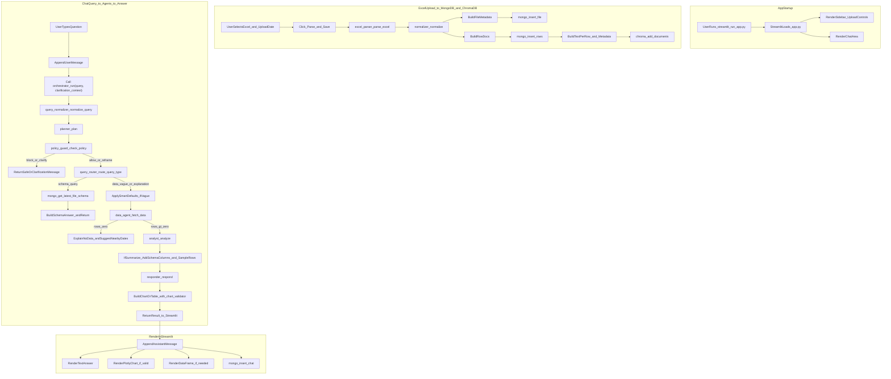

## CA AI Excel Assistant — Monorepo Overview

This repository contains the **full implementation** of a Python-based AI system for a Chartered Accountant firm.  
The main application lives in the `ca-ai-excel-assistant/` folder; the root directory also includes a step-by-step guide and shared configuration.

The system lets you:
- Upload Excel files (with an **upload date** and optional **client tag**).
- Store **structured rows** in MongoDB and **embeddings** in ChromaDB.
- Ask **natural-language, date‑specific questions** in a Streamlit chat UI.
- Run a **multi‑agent pipeline** (Planner → Policy Guard + Router → Data Agent → Analyst → Responder).
- See **charts and tables** generated from your Excel data.

---

### 1. Repository layout

```text
e:/Project/
├── README.md                  # This file (root-level overview)
├── STEP_BY_STEP_GUIDE.md      # Detailed build guide (steps 1–12)
└── ca-ai-excel-assistant/     # Main app (used for local run + deployment)
    ├── app.py                 # Streamlit entrypoint
    ├── api.py                 # Optional FastAPI app (status, future API)
    ├── agents/                # AI orchestration agents
    │   ├── planner.py         # PlannerAgent: intent, dates, client, metric, chart flags
    │   ├── data_agent.py      # DataAgent: MongoDB + ChromaDB access, cached aggregations
    │   ├── analyst.py         # AnalystAgent: numeric calculations, no text generation
    │   ├── responder.py       # ResponseAgent: final natural‑language answer, Groq integration
    │   └── orchestrator.py    # Orchestrator: fixed pipeline, routing, guards, chart prep
    ├── db/
    │   ├── mongo.py           # MongoDB connection + helpers
    │   └── models.py          # File / row / chat document builders
    ├── utils/
    │   ├── excel_parser.py    # pandas-based Excel parsing
    │   ├── normalizer.py      # Column + date + amount normalization
    │   ├── policy_guard.py    # Safety rules (tax evasion, clarifications, reframing)
    │   ├── query_normalizer.py# Fuzzy query normalization (rapidfuzz)
    │   ├── chart_validator.py # Rule-based chart validation
    │   ├── aggregation_cache.py # In-memory cache for daily/monthly totals
    │   └── query_router.py    # Routing to schema/data/vague/explanation, vector vs direct DB
    ├── vector/
    │   └── chroma_client.py   # ChromaDB client (local persistent store)
    ├── docs/
    │   ├── PIPELINE.md        # Detailed pipeline (startup → response)
    │   └── DB_SCHEMA_AND_FLOW.md # DB schemas and data flow
    ├── .streamlit/
    │   ├── config.toml        # Streamlit config (server, theme)
    │   └── secrets.example.toml # Example of secrets for Cloud deployment
    ├── MANUAL_TEST.md         # Manual test scenarios to verify behavior end-to-end
    ├── requirements.txt       # Locked dependencies (FastAPI, Streamlit, MongoDB, ChromaDB, Groq, etc.)
    ├── verify_install.py      # Sanity check for Python deps
    ├── verify_mongo.py        # Sanity check for MongoDB connection
    ├── verify_policy.py       # Sanity check for safety/policy guard
    └── README.md              # App-level README (local setup + deployment notes)
```

---

### 2. Tech stack (locked)

- **UI:** Streamlit (chat UI, upload sidebar, Plotly charts)
- **Backend API:** FastAPI (`api.py`, optional; main logic lives in Streamlit)
- **AI Orchestration:** AutoGen‑style agents (Planner, Data, Analyst, Responder, Orchestrator)
- **LLM:** Groq (free tier) via `groq` Python client
- **Database:** MongoDB Atlas (M0) — collections: `files`, `data_rows`, `chat_history`
- **Vector DB:** ChromaDB (local persistent directory; ephemeral on Streamlit Cloud)
- **Excel Processing:** pandas
- **Charts:** Plotly (rendered inside Streamlit)
- **Deployment:** Streamlit Community Cloud

---

### 3. High‑level workflow (from app start to answer)

Below is the **end‑to‑end workflow** across upload, storage, agents, and UI.



**In words:**

1. **Startup**
   - `streamlit run app.py` renders:
     - Sidebar (upload controls: upload date, client tag, file uploader, help text).
     - Main chat area (`st.chat_input` + message history).

2. **Excel upload**
   - User uploads an Excel file and chooses an **upload date** (mandatory) and **client tag** (optional).
   - `excel_parser.parse_excel()` loads the file into a pandas DataFrame.
   - `normalizer.normalize()`:
     - Cleans column names.
     - Converts dates to ISO `YYYY‑MM‑DD`.
     - Normalizes numeric values (amounts, GST).
   - A new `fileId` is created; `mongo.insert_file()` writes metadata into the `files` collection, including:
     - `fileId`, `uploadDate`, `clientTag`, `filename`, `rowCount`, `columnNames`, `columnCount`, `createdAt`.
   - Each normalized row is turned into a `row_doc` and stored in `data_rows` with:
     - `fileId`, `uploadDate`, `clientTag`, `rowDate` (if present) + dynamic Excel columns.
   - In parallel, one **text blob per row** plus metadata (`uploadDate`, `rowDate`, `clientTag`, `fileId`) is embedded and added to ChromaDB via `vector/chroma_client.py`.

3. **User asks a question**
   - In the chat, the user asks something like:  
     `GST on 2026-02-03` or `Summarize the excel file uploaded on 2 Feb 2026`.
   - The app appends the user message to `st.session_state.messages`.
   - `agents.orchestrator.run()` is called with:
     - The raw query.
     - Any clarification context (if this is a follow‑up to a “Did you mean…?”).

4. **Query normalization + planning**
   - `utils.query_normalizer.normalize_query()`:
     - Uses **rapidfuzz** to correct important tokens (column names, finance keywords, client names).
     - Only changes a token if similarity ≥ 85%, returns:
       - `normalized_query`
       - `correction_map` (original → corrected).
   - `agents.planner.plan()` receives **only the normalized query** and produces structured output:
     - `intent` (e.g. `gst_summary`, `trend`, `compare_dates`, `expense_breakdown`, `summarize`, `explain`).
     - `confidence` (0–1, <0.4 considered ambiguous).
     - `date_filter` and `date_filter_type` (`row_date` vs `upload_date`).
     - `client` / `client_tag`.
     - `metric`.
     - Chart hints: `needs_chart`, `chart_type`, `chart_scope`, `x_axis`, `y_axis`.

5. **Safety + routing**
   - `utils.policy_guard.check_policy()`:
     - Blocks illegal tax evasion queries.
     - Reframes ambiguous legal tax planning queries.
     - May ask for clarification.
   - If `action == "block"` or `"clarify"` → orchestrator returns immediately with a safe/clarifying message.
   - Otherwise, `utils.query_router.route_query_type()` classifies the query into exactly one of:
     - `schema_query` — columns/rows/attributes questions.
     - `data_query` — totals/trends/comparisons.
     - `vague_query` — generic “give chart / show data”.
     - `explanation_query` — explain/summarize/why/insights.
   - **Schema queries**: orchestrator reads metadata via `mongo.get_latest_file_schema()` and answers **without** calling DataAgent or Analyst.

6. **Smart defaults & data fetch**
   - For **vague queries**, `_apply_smart_defaults()`:
     - Picks a sensible `metric` (e.g. GST vs net amount).
     - Clears the date filter (use full dataset).
     - Defaults to a **line chart trend** over time.
   - For non‑schema routes, the orchestrator:
     - Optionally forces `date_filter_type = "upload_date"` when the query clearly refers to “uploaded file”.
     - Expands “month‑only” queries (e.g. “Feb 2026”) to full month ranges.
     - Scopes to the **latest file** by default (attaches `file_id` from `get_latest_file_meta()`).
   - `agents.data_agent.fetch_data()`:
     - Computes a **cache key** based on date range, client, metric.
     - Checks an **in‑memory aggregation cache** (`utils.aggregation_cache`) for daily/monthly totals.
     - When needed, calls `db.mongo.find_rows()` with:
       - `uploadDate` filter (for upload‑based queries).
       - `rowDate` range (for data‑date queries).
       - `clientTag` and `fileId`.
     - Optionally invokes **ChromaDB** (`vector/chroma_client.query()`) but **only** for explanation/summarize/why/insights.
     - Returns:
       - `rows`
       - `daily_totals`
       - `monthly_totals`.

7. **Data existence guard + analysis**
   - If `rows == 0`:
     - Orchestrator does **not** call Analyst.
     - It builds a clear explanation and suggests nearby dates using `mongo.get_nearby_dates_for_client()`.
   - If rows exist:
     - `agents.analyst.analyze()`:
       - Detects appropriate amount/date/category keys.
       - Uses `Decimal` for accurate financial sums.
       - Computes:
         - `total`, `count`, `amount_key`.
         - `date_range` (min/max rowDate).
         - `breakdown` (by category).
         - `series` (for trends).
         - `compare` (for date comparisons).
       - For `summarize` intent: includes both breakdown and series, plus inferred column names.

8. **Summaries, responses, and charts**
   - For `summarize` intent, the orchestrator:
     - Enriches analyst output with **schema column names** from `get_latest_file_schema()`.
     - Serializes the first N rows (typically 200) into `table_data` and sets `show_data_table = True`.
   - `agents.responder.respond()`:
     - Applies policy results (block/clarify/reframe).
     - If Groq is configured:
       - Calls Groq with a strict system prompt to answer **only** from the provided numeric summary.
     - Otherwise:
       - Uses a structured fallback answer that lists context, totals, column names (when present), breakdowns, series, and comparisons.
   - Orchestrator builds `chart_data` from the analyst output:
     - `series` → line chart.
     - `breakdown` → bar or pie chart.
     - `compare` → bar chart.
   - `utils.chart_validator.validate_chart()` ensures:
     - At least 2 data points.
     - Valid x/y axes (date/categorical vs numeric).
     - Sufficient date range for trends.
   - If validation fails, orchestrator:
     - Disables the chart.
     - Fills `table_data` with the same data and sets a clear fallback message.

9. **Rendering in Streamlit**
   - `app.py` takes the orchestrator result and appends an assistant message into `st.session_state.messages` with:
     - Answer text.
     - Chart metadata (`chart_type`, `chart_data`, `chart_fallback_table`, `chart_fallback_message`).
     - Table metadata (`table_data`, `show_data_table`).
     - Debug info (`original_query`, `normalized_query`, `correction_map`, `is_clarification`).
   - For each assistant message, the UI:
     - Shows the answer text.
     - Optionally shows a “Query corrected (log)” expander with normalization details.
     - Renders a **Plotly chart** when:
       - `needs_chart = True`
       - A valid `chart_type` and `chart_data` exist
       - `chart_fallback_table` is `False`.
     - Otherwise, displays a **dataframe table** with either raw data samples or chart data.
   - If MongoDB is configured, each Q&A pair is written to `chat_history`.

---

### 4. What was added beyond a simple CRUD prototype

Compared to a basic “Excel → MongoDB → Streamlit” app, this project adds:

- **AutoGen‑style agent pipeline** (Planner, Data, Analyst, Responder) with a strict orchestrator.
- **Query normalization** using **rapidfuzz** to handle typos on important tokens.
- **Routing + safety layers**:
  - Schema vs data vs vague vs explanation routing.
  - Policy guard for blocking/reframing/clarifying.
  - Clarification state so we don’t loop endlessly.
- **Schema‑aware responses** for:
  - “How many rows/columns?”
  - “What attributes are present?”
- **Smart defaults** for vague prompts such as “give chart” or “show data”.
- **Data existence guard** to explain when no rows match and to suggest nearby dates.
- **In‑memory aggregation cache** for daily/monthly totals to speed up repeated chart queries.
- **Robust charting layer** with validation and graceful fallbacks to tables.
- **Detailed docs**:
  - `STEP_BY_STEP_GUIDE.md` for building the system incrementally.
  - `docs/PIPELINE.md` and `docs/DB_SCHEMA_AND_FLOW.md` for deeper architectural and schema details.

For more implementation details, see:
- [ca-ai-excel-assistant/README.md](ca-ai-excel-assistant/README.md) for environment setup and deployment.
- [ca-ai-excel-assistant/docs/PIPELINE.md](ca-ai-excel-assistant/docs/PIPELINE.md) for the full internal pipeline.
- [STEP_BY_STEP_GUIDE.md](STEP_BY_STEP_GUIDE.md) for the chronological build instructions.

