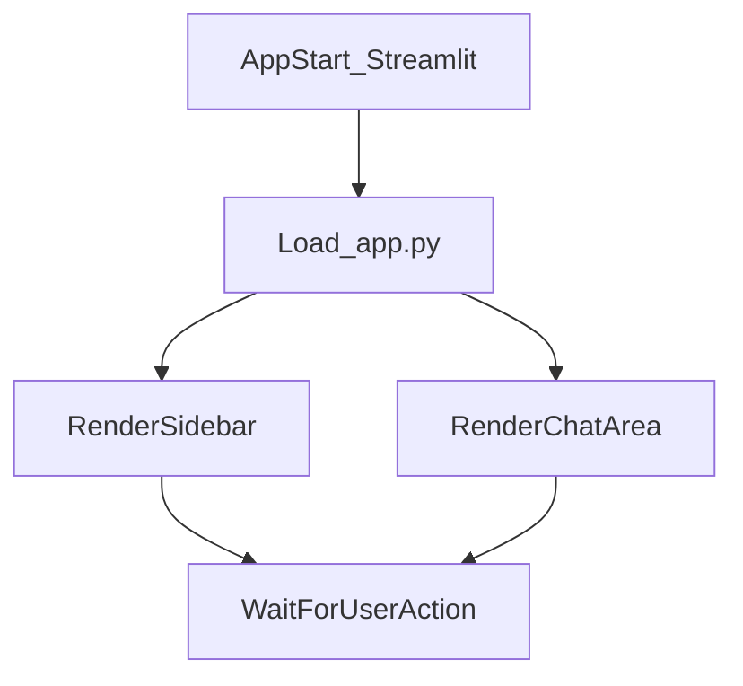
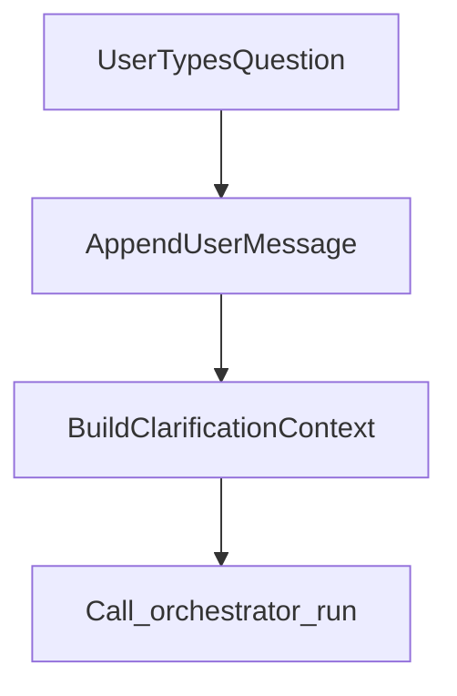
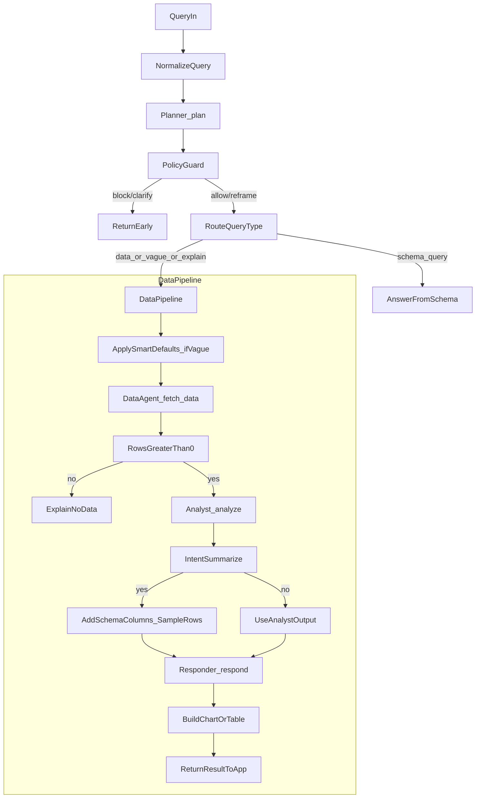

# CA AI Excel Assistant — Pipeline (App Start to User Response)

This document describes the end-to-end flow from app start to the response shown to the user.

---

## 1. App start (Streamlit)

```
streamlit run app.py
```



| Step | Component | What happens |
|------|-----------|----------------|
| 1.1 | **Streamlit** | Loads `app.py`, sets page config (title, icon, wide layout). |
| 1.2 | **Sidebar** | Renders: Upload date, Client tag, Excel file uploader. |
| 1.3 | **Main area** | Renders: Chat subheader, empty chat or `st.session_state.messages`, chat input. |
| 1.4 | **Session** | `st.session_state.messages` = [] if not set; optional "How to use" expander and MongoDB warning. |

**Result:** User sees sidebar (upload + context) and chat area. No backend pipeline runs until user acts.

---

## 2. Two user entry points

- **Path A — Excel upload:** User selects date, optional client tag, chooses file, clicks **"Parse and save to database"**.
- **Path B — Chat:** User types a question in the chat input and sends.

---

## 3. Path A — Excel upload pipeline

```mermaid
graph TD
  userUpload[UserUploadsExcel] --> clickParse[Click_Parse_and_Save]
  clickParse --> parseExcel[parse_excel(BytesIO)]
  parseExcel --> normalizeDf[normalize(DataFrame)]
  normalizeDf --> buildMeta[BuildFileMetadata]
  buildMeta --> insertFile[Mongo_insert_file]
  normalizeDf --> buildRows[BuildRowDocs]
  buildRows --> insertRows[Mongo_insert_rows]
  insertRows --> buildEmb[BuildTextsAndMetadata]
  buildEmb --> chromaAdd[Chroma_add_documents]
```

```
[User] Select date + file → Click "Parse and save to database"
         │
         ▼
┌─────────────────────────────────────────────────────────────────────────┐
│ 3.1  Read file bytes → parse_excel(BytesIO(raw)) → DataFrame              │
│ 3.2  normalize(df) → norm_df, column_names (dates ISO, amounts float)    │
│ 3.3  file_id = uuid, upload_date_str, row_count, column_count             │
│ 3.4  mongo.insert_file(..., column_names, column_count)                   │
│ 3.5  For each row: row_doc(...) → mongo.insert_rows(rows)                 │
│ 3.6  chroma_client.add_documents(texts, metadatas, ids) — one text/row   │
│ 3.7  st.success / st.warning / st.error                                   │
└─────────────────────────────────────────────────────────────────────────┘
         │
         ▼
[User] Sees "Saved: filename — N rows. Embeddings stored." (or error)
```

| Step | Module | Responsibility |
|------|--------|-----------------|
| 3.1 | `utils/excel_parser` | Parse .xlsx/.xls → pandas DataFrame. |
| 3.2 | `utils/normalizer` | Normalize column names, dates → ISO, amounts → float. |
| 3.4–3.5 | `db/mongo` | Insert file metadata (with column_names, column_count) and data_rows. |
| 3.6 | `vector/chroma_client` | Embed row text and store in ChromaDB with metadata (uploadDate, rowDate, clientTag, fileId). |

**Result:** Data is in MongoDB (files + data_rows) and ChromaDB (embeddings). User can now ask questions in chat.

---

## 4. Path B — Chat pipeline (query → response)

When the user sends a message, the app calls `orchestrator_run(prompt, clarification_context)` and then renders the returned `answer` plus optional chart/table.



High-level flow:

```
[User] Types question → Enter
         │
         ▼
┌──────────────────────────────────────────────────────────────────────────┐
│  APP (app.py)                                                             │
│  • Append user message to st.session_state.messages                      │
│  • If previous message was clarification, set clarification_context       │
│  • orchestrator_run(prompt, clarification_context)                       │
│  • Append result (answer, chart_data, table_data, show_data_table, …)     │
│  • Optionally mongo.insert_chat(prompt, answer, …)                        │
│  • st.rerun() → render messages (answer + chart/table)                     │
└──────────────────────────────────────────────────────────────────────────┘
         │
         ▼
┌──────────────────────────────────────────────────────────────────────────┐
│  ORCHESTRATOR (agents/orchestrator.py) — run(query, clarification_context)│
└──────────────────────────────────────────────────────────────────────────┘
```

Detailed pipeline inside the orchestrator and downstream:



```
 4.0   Empty query?
       └─ Yes → Return "Please ask a question..." ; STOP

 4.1   Query normalization (utils/query_normalizer)
       • normalize_query(original_query) → normalized_query, correction_map
       • Typo/term corrections (e.g. "gst" → "GST"); logged

 4.2   Planner (agents/planner)
       • plan(normalized_query) → intent, confidence, date_filter, date_filter_type,
         client_tag, metric, needs_chart, chart_type, x_axis, y_axis, dates

 4.3   Policy guard (utils/policy_guard)
       • check_policy(normalized_query, planner_output) → action, message
       • action in { block, clarify, reframe, allow }
       • block → Return policy message ; STOP
       • clarify → Return clarify message ; STOP

 4.4   Query router (utils/query_router)
       • route_query_type(planner_output, normalized_query)
       • Returns: schema_query | data_query | vague_query | explanation_query

 4.5   Schema query?
       • If schema_query → mongo.get_latest_file_schema() → _build_schema_answer()
       • Return answer (columns/rows/attributes) ; STOP (no DataAgent, no Analyst)

 4.6   Low confidence + not confirmed?
       • If confidence < 0.4 and not clarification_confirmed
       • → _build_clarification_question(planner_output)
       • Return clarification (e.g. "Did you mean GST for 12 Jan 2025?") ; STOP

 4.7   Vague query?
       • If vague_query → _apply_smart_defaults(planner_output) (metric, full date range, line chart)

 4.8   Data agent (agents/data_agent)
       • fetch_data(planner_output, normalized_query)
       • Cache key from planner; if cache hit → return cached
       • mongo.find_rows(upload_date, client_tag, row_date_from, row_date_to, limit=500)
       • If route_query → "vector_search": chroma_client.query(...) (for explain/summarize/insights)
       • compute_daily_totals(rows), compute_monthly_totals(rows)
       • Returns: { rows, daily_totals, monthly_totals } ; cache result

 4.9   No data?
       • If len(rows) == 0 → _build_no_data_explanation() + get_nearby_dates_for_client()
       • Return explanation + suggestions ; STOP (no Analyst)

 4.10  Analyst (agents/analyst)
       • analyze(intent, data) → total, count, amount_key, date_range, breakdown, series, compare, etc.
       • Uses Decimal for money; 2-decimal rounding
       • By intent: gst_summary, summarize, expense_breakdown, trend, compare_dates

 4.11  Summarize intent?
       • If intent == "summarize" → get_latest_file_schema() → add column_names to analyst_output
       • summary_table_data = first 200 rows serialized; show_data_table = True

 4.12  Responder (agents/responder)
       • respond(planner_output, analyst_output, normalized_query, policy_action, policy_message)
       • If block/risk → return safe message
       • Build context string; is_summary = (intent == "summarize")
       • If GROQ_API_KEY: Groq chat completion (system + user with context + question + data summary)
       • Else or on error: _format_fallback_answer(planner_output, analyst_output, is_summary)
       • Returns final answer string

 4.13  Chart/table payload (orchestrator)
       • Build chart_data from analyst_output (series | breakdown | compare)
       • If needs_chart and chart_data: validate_chart(df_chart, planner_output)
       • If !needs_chart or !validate → chart_fallback_table = True, table_data = chart data as table
       • If summarize: out_table_data = summary_table_data (first 200 rows)

 4.14  Return
       • { answer, needs_chart, chart_type, chart_data, chart_fallback_table,
           chart_fallback_message, table_data, show_data_table, original_query,
           normalized_query, correction_map, is_clarification }
```

---

## 5. App display (after orchestrator returns)

| Step | What the app does |
|------|-------------------|
| 5.1 | Append assistant message to `st.session_state.messages` with answer, chart_data, table_data, show_data_table, correction_map, etc. |
| 5.2 | If MongoDB connected → `mongo.insert_chat(prompt, answer, ...)`. |
| 5.3 | `st.rerun()` → Re-render. |
| 5.4 | For each message in `messages`: render `st.chat_message`, show correction_map in expander (if any), `st.write(content)`. |
| 5.5 | If `needs_chart` and chart_type and chart_data and not chart_fallback_table → `_render_chart(chart_type, chart_data)` (Plotly). |
| 5.6 | If `show_data_table` and table_data → caption "Sample of uploaded data (first 200 rows)" + `st.dataframe(table_data)`. |
| 5.7 | Else if chart_fallback_table and table_data → caption + `st.dataframe(table_data)`. |
| 5.8 | Else if table_data → `st.dataframe(table_data)`. |

**Result:** User sees their question, the natural-language answer, and (when applicable) a chart or data table.

---

## 6. Flow diagram (chat path only)

```
                    ┌─────────────────┐
                    │  User question  │
                    └────────┬────────┘
                             │
                             ▼
                    ┌─────────────────┐
                    │ Normalize query │  (query_normalizer)
                    └────────┬────────┘
                             │
                             ▼
                    ┌─────────────────┐
                    │     Planner     │  intent, dates, client, metric, chart flags
                    └────────┬────────┘
                             │
                             ▼
                    ┌─────────────────┐
                    │  Policy guard   │  block / clarify / reframe / allow
                    └────────┬────────┘
                             │
              ┌──────────────┼──────────────┐
              │ block/clarify               │ allow
              ▼                              ▼
       Return message; exit          ┌─────────────────┐
                                     │  Query router   │  schema | data | vague | explanation
                                     └────────┬────────┘
                                              │
                    ┌─────────────────────────┼─────────────────────────┐
                    │ schema_query            │ data_query / vague / explanation
                    ▼                         ▼
             Schema from MongoDB;       ┌─────────────────┐
             return columns/rows; exit   │   Data agent    │  MongoDB (+ optional ChromaDB)
                                        └────────┬────────┘
                                                 │
                                    ┌────────────┼────────────┐
                                    │ rows == 0  │ rows > 0   │
                                    ▼            ▼            │
                             No-data message;   ┌─────────────────┐
                             exit               │    Analyst     │  total, breakdown, series, compare
                                                └────────┬────────┘
                                                         │
                                                ┌────────┴────────┐
                                                │ summarize?      │
                                                │ → column_names, │
                                                │   table_data    │
                                                └────────┬────────┘
                                                         │
                                                         ▼
                                                ┌─────────────────┐
                                                │   Responder      │  Groq or fallback → answer text
                                                └────────┬────────┘
                                                         │
                                                         ▼
                                                ┌─────────────────┐
                                                │ Chart/table      │  validate_chart; fallback table if needed
                                                │ payload build   │
                                                └────────┬────────┘
                                                         │
                                                         ▼
                                                ┌─────────────────┐
                                                │ Return to app   │  answer + chart_data + table_data
                                                └────────┬────────┘
                                                         │
                                                         ▼
                                                ┌─────────────────┐
                                                │ App renders      │  answer + Plotly chart / dataframe
                                                │ message + chart   │
                                                └─────────────────┘
```

---

## 7. File reference

| Stage | File(s) |
|-------|---------|
| App entry, upload, chat UI | `app.py` |
| Orchestrator (pipeline control) | `agents/orchestrator.py` |
| Query normalization | `utils/query_normalizer.py` |
| Planner | `agents/planner.py` |
| Policy guard | `utils/policy_guard.py` |
| Query router | `utils/query_router.py` |
| Data agent | `agents/data_agent.py` |
| Analyst | `agents/analyst.py` |
| Responder | `agents/responder.py` |
| Chart validation | `utils/chart_validator.py` |
| DB | `db/mongo.py` |
| Vector store | `vector/chroma_client.py` |
| Excel parse / normalize | `utils/excel_parser.py`, `utils/normalizer.py` |

This is the full pipeline from app start to the response given to the user.
