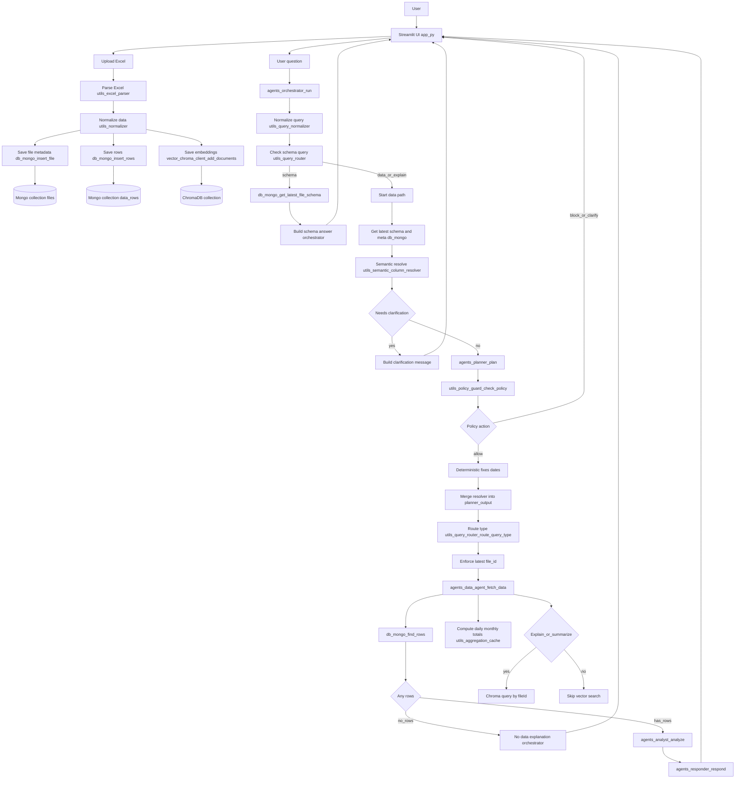

```mermaid
flowchart TD
  %% ENTRY
  User --> UI[Streamlit UI app_py]

  %% UPLOAD FLOW
  UI --> Upload[Upload Excel]
  Upload --> Parse[Parse Excel utils_excel_parser]
  Parse --> Normalize[Normalize data utils_normalizer]
  Normalize --> SaveFileMeta[Save file metadata db_mongo_insert_file]
  Normalize --> SaveRows[Save rows db_mongo_insert_rows]
  Normalize --> SaveEmb[Save embeddings vector_chroma_client_add_documents]

  SaveFileMeta --> MongoFiles[(Mongo collection files)]
  SaveRows --> MongoRows[(Mongo collection data_rows)]
  SaveEmb --> Chroma[(ChromaDB collection)]

  %% QUERY FLOW
  UI --> Ask[User question]
  Ask --> Orchestrator[agents_orchestrator_run]

  Orchestrator --> QNorm[Normalize query utils_query_normalizer]
  QNorm --> SchemaCheck[Check schema query utils_query_router]

  %% SCHEMA PATH
  SchemaCheck -->|schema| GetSchema[db_mongo_get_latest_file_schema]
  GetSchema --> BuildSchema[Build schema answer orchestrator]
  BuildSchema --> UI

  %% DATA / EXPLAIN PATH
  SchemaCheck -->|data_or_explain| StartData[Start data path]

  StartData --> GetLatest[Get latest schema and meta db_mongo]
  GetLatest --> SemResolver[Semantic resolve utils_semantic_column_resolver]
  SemResolver --> Clarify{Needs clarification}
  Clarify -->|yes| ClarMsg[Build clarification message]
  ClarMsg --> UI

  Clarify -->|no| Planner[agents_planner_plan]
  Planner --> Policy[utils_policy_guard_check_policy]
  Policy --> Action{Policy action}

  Action -->|block_or_clarify| UI
  Action -->|allow| Fixes[Deterministic fixes dates]

  Fixes --> Merge[Merge resolver into planner_output]
  Merge --> RouteType[Route type utils_query_router_route_query_type]
  RouteType --> EnforceFile[Enforce latest file_id]

  %% DATA FETCH
  EnforceFile --> DataAgent[agents_data_agent_fetch_data]
  DataAgent --> FindRows[db_mongo_find_rows]
  DataAgent --> Agg[Compute daily monthly totals utils_aggregation_cache]
  FindRows --> RowsCheck{Any rows}

  %% OPTIONAL RAG
  DataAgent --> RagCheck{Explain_or_summarize}
  RagCheck -->|yes| RagQuery[Chroma query by fileId]
  RagCheck -->|no| RagSkip[Skip vector search]

  %% NO DATA
  RowsCheck -->|no_rows| NoData[No data explanation orchestrator]
  NoData --> UI

  %% ANALYSIS + RESPONSE
  RowsCheck -->|has_rows| Analyst[agents_analyst_analyze]
  Analyst --> Responder[agents_responder_respond]
  Responder --> UI
```
