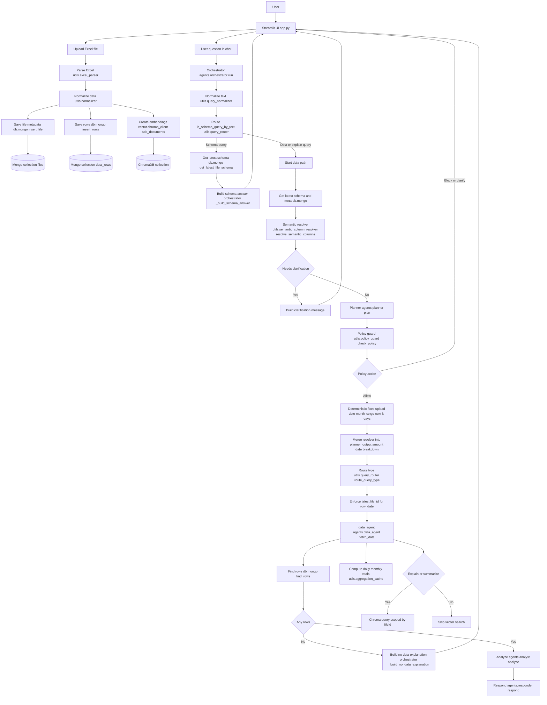

```mermaid
flowchart TD
  %% Entry points
  U[User] --> UI[Streamlit UI app.py]

  %% Upload flow
  UI --> UP[Upload Excel file]
  UP --> EP[Parse Excel utils.excel_parser]
  EP --> NORM[Normalize data utils.normalizer]
  NORM --> MF[Save file metadata db.mongo insert_file]
  NORM --> MR[Save rows db.mongo insert_rows]
  NORM --> VE[Create embeddings vector.chroma_client add_documents]

  MF --> MF_COLL[(Mongo collection files)]
  MR --> MR_COLL[(Mongo collection data_rows)]
  VE --> CH_COLL[(ChromaDB collection)]

  %% Query flow
  UI --> QIN[User question in chat]
  QIN --> ORCH[Orchestrator agents.orchestrator run]

  %% Normalize and early routing
  ORCH --> QN[Normalize text utils.query_normalizer]
  QN --> RT1[Route is_schema_query_by_text utils.query_router]

  RT1 -->|Schema query| S1[Get latest schema db.mongo get_latest_file_schema]
  S1 --> S2[Build schema answer orchestrator _build_schema_answer]
  S2 --> UI

  RT1 -->|Data or explain query| DSTART[Start data path]

  %% Semantic resolution
  DSTART --> LS[Get latest schema and meta db.mongo]
  LS --> RES[Semantic resolve utils.semantic_column_resolver resolve_semantic_columns]
  RES --> CLAR{Needs clarification}
  CLAR -->|Yes| CM[Build clarification message]
  CM --> UI

  CLAR -->|No| PLAN[Planner agents.planner plan]
  PLAN --> POL[Policy guard utils.policy_guard check_policy]
  POL --> ACT{Policy action}

  ACT -->|Block or clarify| UI
  ACT -->|Allow| FIX[Deterministic fixes upload date month range next N days]

  %% Merge resolution and route
  FIX --> MERGE[Merge resolver into planner_output amount date breakdown]
  MERGE --> RT2[Route type utils.query_router route_query_type]
  RT2 --> ENF[Enforce latest file_id for row_date]

  %% Data fetch
  ENF --> DA[data_agent agents.data_agent fetch_data]
  DA --> FR[Find rows db.mongo find_rows]
  DA --> AGG[Compute daily monthly totals utils.aggregation_cache]
  FR --> ROWS_FOUND{Any rows}

  %% Optional RAG retrieval
  DA --> RAG_CHECK{Explain or summarize}
  RAG_CHECK -->|Yes| RAGQ[Chroma query scoped by fileId]
  RAG_CHECK -->|No| RAG_SKIP[Skip vector search]

  %% No data path
  ROWS_FOUND -->|No| ND[Build no data explanation orchestrator _build_no_data_explanation]
  ND --> UI

  %% Analysis and response
  ROWS_FOUND -->|Yes| AN[Analyze agents.analyst analyze]
  AN --> RESP[Respond agents.responder respond]
```
  RESP --> UI
